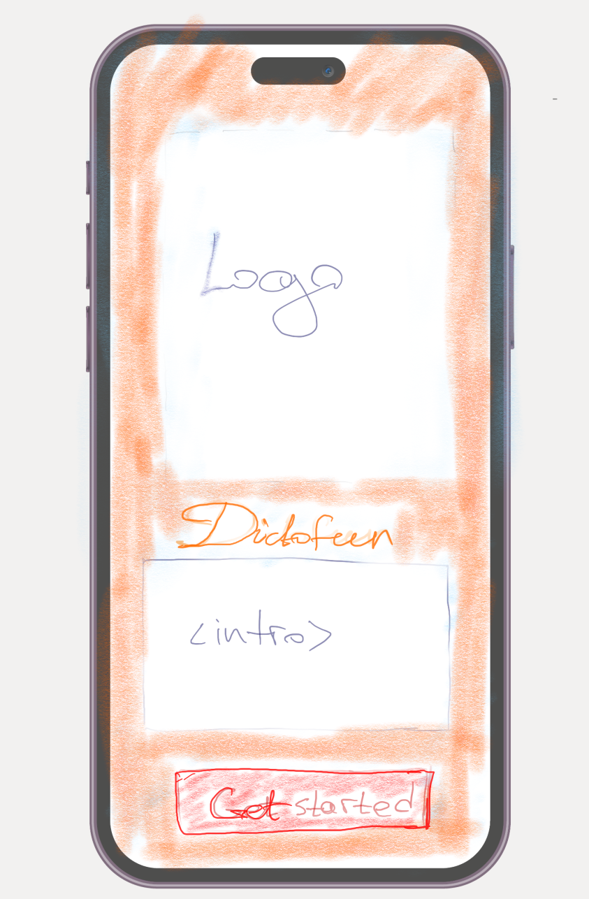
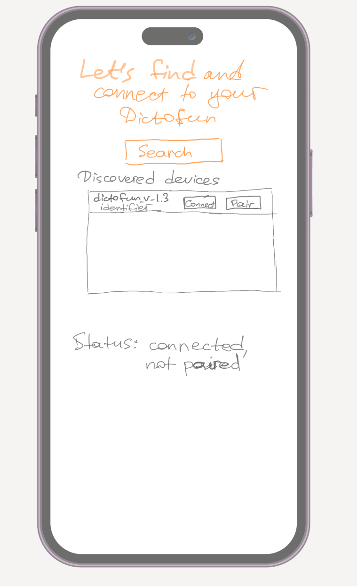
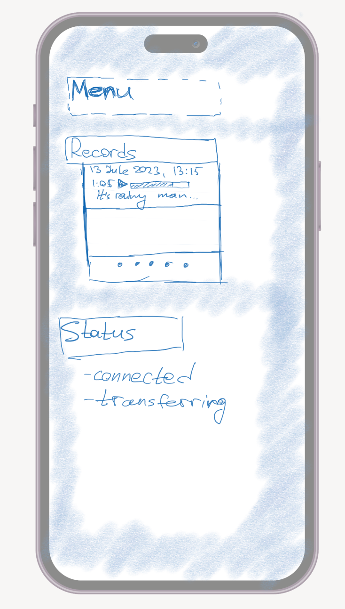
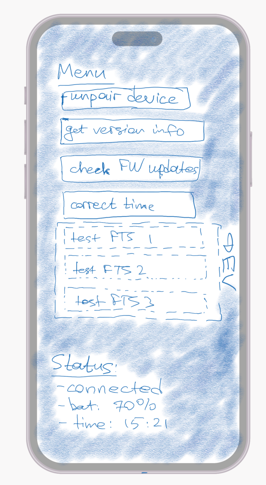

# Dictofun iOS App design 

This design document is targeted at implementing requirements v1.0.0.

## Architecture

Application shall follow the MVC architecture pattern.

**View** shall be responsible for user interaction. **Model** is responsible for interaction with BLE subsystem, files storage, and etc. **Controller** is responsible for connections between **view** and **model** elements.

### Model

Model shall be responsible for BLE communication, files' storage, configuration storage. 

For BLE operations, [BluetoothManager](https://github.com/NordicSemiconductor/IOS-nRF-Toolbox/blob/master/nRF%20Toolbox/BluetoothManager/BluetoothManager.swift) from Nordic shall be used as a reference. All BLE-related functions shall reside in this class at the first stage, and can later be separated to smaller entities.

For records' storage, local file storage shall be used. Separate database should be instantiated to contain information about all records that have been downloaded from the device.

For voice transcription, Apple's framework shall be used. 

### View

UIKit shall be used as a framework for Views' implementation. 

Application shall provide different initial screen, depending on whether the device has already been paired or not.

In case if no paired devices have been found, view shall provide sufficient amount of control elements to connect to, disconnect from and pair a device.

Different coloring schemes shall be used to display paired/unpaired states of the application.

#### Initial view

Label `Intro` gives a short description on what this application does. Optionally this text can be split to 3 images that can be slided,

Button `Get Started` takes the user to `Connection View`.

#### Connection View

Label at the top gives a short description of what we are doing at this view.

Button `Search` starts the BLE scanning in search of a working Dictofun close by. 

When a device is discovered, a corresponding entry shows up at the list of the discovered devices. This entry contains: device name, device ID, buttons `Connect` and `Pair`. `Pair` is active only if the device is connected. `Connect` changes text and function to `Disconnect` after the event of connection.

`Status` label represents a minimal status information about the current connectivity state (connected/disconnected, not paired/paired).

Immediately after the pairing this view is closing and the user is taken to the `Records View`.

#### Records View

Button `Menu` takes the user to the settings' Menu (see below).

Next the records are listed in a records' list. At this sub-list only last 3 records are displayed. To access all of the records one has to press the entry with multiple dots.

Under the list of records the current status is displayed. Following status entries are displayed: connection status, FTS transferring status also displayed, if transfer is running. 

#### Menu View

This menu contains all additional functions needed by the app: unpairing button, firmware update checker, and in the development mode - buttons that launch `FTS` functions' tests. Also some status entries can be displayed. When button with arrow at the top of the screen is pressed, user is taken back to records' view.

#### All records view.

When user presses on the button with multiple dots at the records view, he is taken to the view with all records. It contains entries similar to ones listed at the middle of records' view, but displays all records. Old entries (beyond last 10) can be hidden under a spoiler to assure a faster operation in the default scenario.

### Controller

Controller shall perform connections between the **View** and **Model** and shall not contain any business logic except for connections. 
